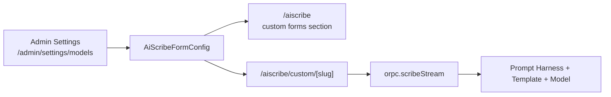
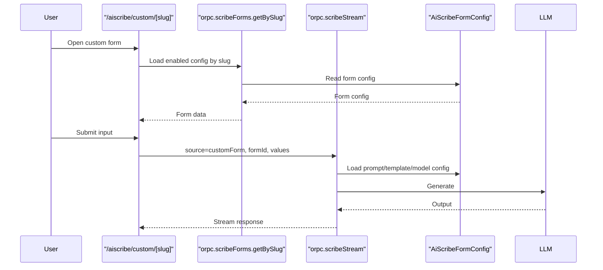

# AI Forms Plan

## Goal

Add admin-managed custom AIScribe forms as extra pages on top of the current built-in AIScribe pages.

- Built-in pages stay as they are.
- Custom forms are additive.
- First version should be minimal and easy to ship.

## MVP

One admin can create a custom AI form with:

- `name`
- `slug`
- `enabled`
- `inputPreset`
- `promptHarness`
- optional `templateId`
- optional `modelId`
- optional `temperature`
- optional `maxTokens`
- optional `thinkingBudget`

Users can then:

- see enabled custom forms on `/aiscribe`
- open `/aiscribe/custom/[slug]`
- generate output using that config

## What We Are Not Doing First

- no replacement of built-in AIScribe pages
- no DB override layer for existing built-in pages
- no admin playground integration
- no fully dynamic form builder
- no migration of all built-in `documentTypeConfigs` into DB

## Minimal Architecture

## Data Model

Table: `AiScribeFormConfig`

- `id`
- `slug` unique
- `name`
- `description` nullable
- `enabled`
- `inputPreset`
- `promptHarness`
- `templateId` nullable
- `modelId` nullable
- `temperature` nullable
- `maxTokens` nullable
- `thinkingBudget` nullable
- `createdAt`
- `updatedAt`

Validation:

- `slug` must be unique and URL-safe
- `slug` must not conflict with built-in routes like `er`, `icu`, `outpatient`, `discharge`, `procedures`, `diagnoseblock`, `editor`, `custom`
- `inputPreset` must be one of the supported presets
- `templateId` and `modelId` must exist if set

## Input Presets

Keep this small at the start:

- `notesOnly`
- `notesWithDiagnoseblock`
- `fullClinicalContext`
- `procedures`

Mapping:

- `notesOnly` -> `notes`
- `notesWithDiagnoseblock` -> `notes`, `diagnoseblock`
- `fullClinicalContext` -> `notes`, `anamnese`, `diagnoseblock`, `befunde`
- `procedures` -> `notes`

## API

### Admin

Namespace: `orpc.admin.scribeForms.*`

- `list`
- `create`
- `update`
- `delete`

### Public

Namespace: `orpc.scribeForms.*`

- `listAvailable`
- `getBySlug`

### Prompt Catalog

For the first version, prompt selection can reuse the current admin prompt list. Later this can become its own prompt catalog.

## UI

### Admin

Add a third tab to `/admin/settings/models`:

- `Verbindungen`
- `Modelle`
- `AI Forms`

Minimal UI:

- simple list of forms
- `Neue Form` button
- create/edit form with the MVP fields
- enable/disable toggle
- delete action

Important:

- the `AI Forms` tab should still render even if no providers exist

### User

On `/aiscribe`:

- keep the existing built-in cards
- add a second section: `Custom Forms`

Add a new page:

- `/aiscribe/custom/[slug]`

That page should use a generic AIScribe shell and pick fields from `inputPreset`.

## Runtime

Keep one stream endpoint and extend the request shape:

- built-in: `{ source: "documentType", documentType, ... }`
- custom: `{ source: "customForm", formId, ... }`

Custom request flow:

## Minimal Implementation Order

### Phase 1

Add the database table and schema.

Deliver:

- `AiScribeFormConfig` migration
- Drizzle schema
- zod schemas for create/update

### Phase 2

Add the APIs.

Deliver:

- `admin.scribeForms.list/create/update/delete`
- `scribeForms.listAvailable/getBySlug`

### Phase 3

Add the admin UI.

Deliver:

- `AI Forms` tab
- simple list
- simple create/edit form

### Phase 4

Add the user-facing pages.

Deliver:

- custom forms section on `/aiscribe`
- `/aiscribe/custom/[slug]`

### Phase 5

Wire generation.

Deliver:

- `scribeStream` support for `source: "customForm"`
- config lookup by `formId`
- prompt/template/model resolution from DB

## Acceptance Criteria

- Admin can create a custom form without code changes.
- Enabled custom forms appear on `/aiscribe`.
- A custom form page can generate output.
- Built-in AIScribe pages still work unchanged.

## Risks

- `AI Forms` tab is currently blocked by the provider-empty state.
- Prompt list is still tied to current built-in configs.
- Input presets must stay small or the first version will become a form builder project.

## Recommendation

Start with the smallest useful slice:

1. one DB table
2. admin CRUD
3. one custom route
4. one stream extension

That is enough to prove the feature without touching the built-in AIScribe architecture more than necessary.
